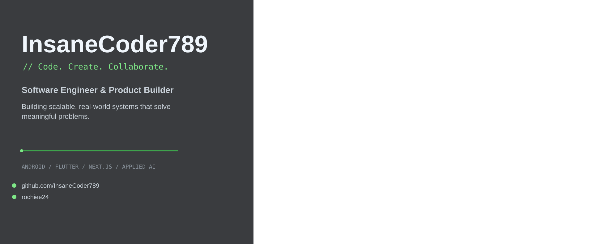
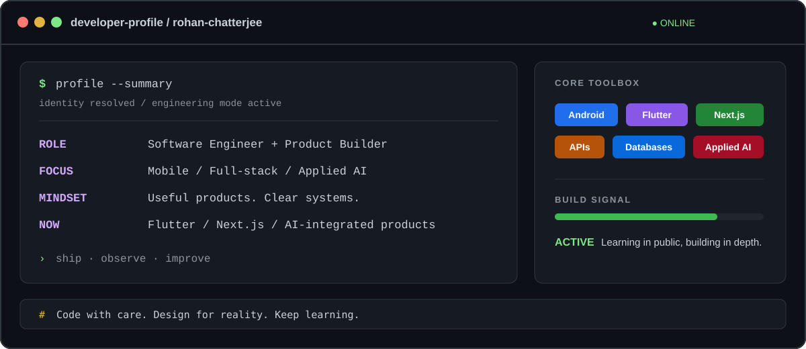
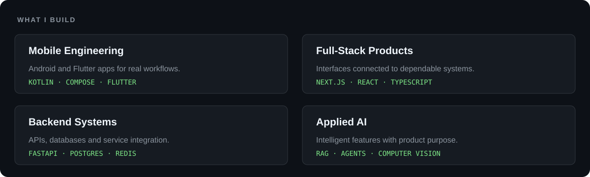
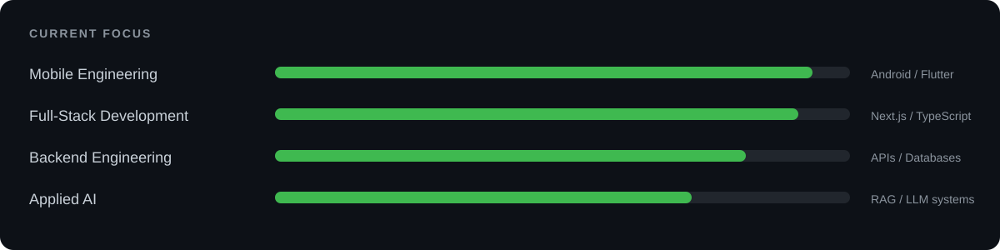
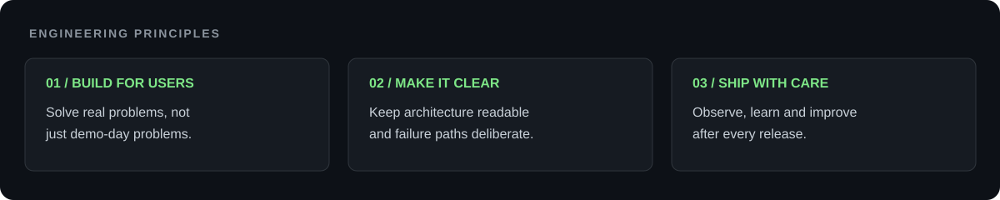

<div align="center">



<br/>


<a href="https://github.com/InsaneCoder789">
  
</a>
<a href="https://www.linkedin.com/in/rochiee24">
  
</a>
<a href="mailto:chatterjeerohan0204@gmail.com">
  
</a>
<a href="https://instagram.com/rochiee24">
  
</a>

<br/><br/>

> **Build. Ship. Learn. Repeat.**

I build end-to-end digital products across **mobile, web, backend systems and applied AI** — with an emphasis on architecture, usability, reliability and real-world deployment.

</div>

---

## About

<div align="center">



</div>

---

## Tech Stack

<div align="center">

### Languages


<br/><br/>

### Mobile & Frontend


<br/><br/>

### Backend & APIs


<br/><br/>

### Databases


<br/><br/>

### AI / Data


<br/><br/>

### Infrastructure & Tooling


</div>

---

## What I Build



---

## Current Focus



---

## Engineering Principles



---

## GitHub

<div align="center">


<br/>


<br/><br/>


</div>

---

## Beyond the Commit

I like projects that force me to think across boundaries:

- how the interface affects the architecture
- how the architecture behaves when something fails
- how data moves through the system
- how the system grows without becoming impossible to maintain
- and whether the finished product actually solves something meaningful

```text
Idea
 ↓
Prototype
 ↓
Architecture
 ↓
Build
 ↓
Break
 ↓
Understand
 ↓
Improve
 ↓
Ship
```

---

<div align="center">

### `</>` Code. &nbsp; `✦` Create. &nbsp; `↗` Collaborate.

<br/>

**Engineering ideas into real-world products.**

<br/>

<a href="mailto:chatterjeerohan0204@gmail.com">

</a>

<br/><br/>

<sub>Designed around products, systems and the process of getting better at building both.</sub>

</div>
