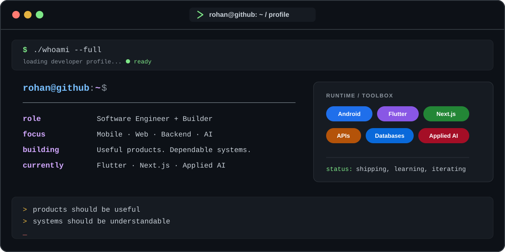

<div align="center">


<br/>

# Rohan Chatterjee

### Software Engineer & Product Builder

`Android` · `Flutter` · `Next.js` · `Full-Stack` · `Applied AI`

<br/>

<a href="https://github.com/InsaneCoder789">
  
</a>
<a href="https://www.linkedin.com/in/rochiee24">
  
</a>
<a href="mailto:chatterjeerohan0204@gmail.com">
  
</a>
<a href="https://instagram.com/rochiee24">
  
</a>

<br/><br/>

> **Build. Ship. Learn. Repeat.**

I build end-to-end digital products across **mobile, web, backend systems and applied AI** — with an emphasis on architecture, usability, reliability and real-world deployment.

</div>

---

## `01.` About

<div align="center">



</div>

---

## `02.` Tech Stack

<div align="center">

### Languages


<br/><br/>

### Mobile & Frontend


<br/><br/>

### Backend & APIs


<br/><br/>

### Databases


<br/><br/>

### AI / Data


<br/><br/>

### Infrastructure & Tooling


</div>

---

## `03.` What I Build

<table>
<tr>
<td width="50%" valign="top">

### 📱 Mobile Engineering

Native and cross-platform applications built around real product workflows.

**Working with**

`Kotlin` `Jetpack Compose` `Flutter` `Android`

</td>

<td width="50%" valign="top">

### 🌐 Full-Stack Products

Interfaces backed by APIs, authentication, persistence and deployment infrastructure.

**Working with**

`Next.js` `React` `TypeScript` `Node.js`

</td>
</tr>

<tr>
<td width="50%" valign="top">

### ⚙️ Backend Systems

API architecture, application logic, database design and service integration.

**Working with**

`FastAPI` `Express` `PostgreSQL` `Redis`

</td>

<td width="50%" valign="top">

### 🧠 Applied AI

Using AI where it improves the product rather than adding it for the sake of a feature list.

**Exploring**

`RAG` `LLMs` `Agents` `Computer Vision`

</td>
</tr>
</table>

---

## `04.` Selected Projects

<table>
<tr>
<td width="50%" valign="top">

### 🛡️ Lakshman Rekha

**Android Security Platform**

A mobile-first security project focused on practical protection mechanisms and intelligent threat-aware workflows.

`Kotlin` `Android` `Security`

<a href="https://github.com/InsaneCoder789/Lakshman-Rekha">
  
</a>

</td>

<td width="50%" valign="top">

### 🎓 ClassSync

**Academic Productivity Platform**

An Android application designed around classroom workflows, planning, synchronization and student productivity.

`Kotlin` `Jetpack Compose` `Room`

<a href="https://github.com/InsaneCoder789/ClassSync">
  
</a>

</td>
</tr>

<tr>
<td width="50%" valign="top">

### 🧭 NavGate

**Mobile Navigation System**

An Android navigation project integrating location services, mapping and routing workflows.

`Kotlin` `OSMDroid` `Location APIs`

<a href="https://github.com/InsaneCoder789/NavGate">
  
</a>

</td>

<td width="50%" valign="top">

### 🚨 MGHSIS

**Mass-Gathering Human Safety Intelligence System**

A safety intelligence platform designed around crowd-risk fusion, wearable telemetry, digital twins and real-time response coordination.

`Next.js` `Applied AI` `Analytics` `Digital Twin`

</td>
</tr>
</table>

<div align="center">

### Explore everything I've built

<a href="https://github.com/InsaneCoder789?tab=repositories">

</a>

</div>

---

## `05.` Current Focus

```text
Mobile Engineering        ███████████████████░   Android / Flutter
Full-Stack Development    ███████████████████░   Next.js / TypeScript
Backend Engineering       █████████████████░░░   APIs / Databases
Applied AI                ███████████████░░░░░   RAG / LLM Systems
System Design             █████████████░░░░░░░   Scaling / Reliability
```

Right now I'm particularly interested in connecting **product engineering with applied AI** — building systems where mobile/web interfaces, backend architecture and intelligent components operate as one coherent product.

---

## `06.` Engineering Principles

```diff
+ Build for users, not demos.
+ Make architecture understandable.
+ Prefer boring reliability over unnecessary complexity.
+ Design failure paths before production finds them.
+ Treat AI as a system component, not a magic layer.
+ Ship, observe, improve.
```

---

## `07.` GitHub

<div align="center">


<br/>


<br/><br/>


</div>

---

## `08.` Beyond the Commit

I like projects that force me to think across boundaries:

- how the interface affects the architecture
- how the architecture behaves when something fails
- how data moves through the system
- how the system grows without becoming impossible to maintain
- and whether the finished product actually solves something meaningful

```text
Idea
 ↓
Prototype
 ↓
Architecture
 ↓
Build
 ↓
Break
 ↓
Understand
 ↓
Improve
 ↓
Ship
```

---

<div align="center">

### `</>` Code. &nbsp; `✦` Create. &nbsp; `↗` Collaborate.

<br/>

**Engineering ideas into real-world products.**

<br/>

<a href="mailto:chatterjeerohan0204@gmail.com">

</a>

<br/><br/>

<sub>Designed around products, systems and the process of getting better at building both.</sub>

</div>
